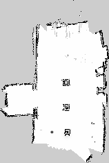

# Navigating Robots - Turtlebot and Kuri
## Description 
A Turtlebot and Kuri were both given a challenge of navigating an obstacle course (containing boxes and cones). This was done to test whose navigation and localization was better in a static and dynamic environment (dynamic refers to when both robots are navigating the obstacle course together). 

## Map

- Squares are boxes.
- Dots are cones.

## Navigation Demo
[](https://www.youtube.com/watch?v=MbGdPQNUCcQ)

## How to Run
### 1. Source environment vars
```
catkin_make
source /opt/ros/kinetic/setup.bash (Depending on where ROS is installed)
source devel/setup.bash
```

### 2. Commands to Run
#### With Gazebo
```
roslaunch turtlebot_gazebo turtlebot_world.launch
roslaunch turtlebot_gazebo amcl_demo.launch map_file:=[MAP_FULL_PATH]
roslaunch turtlebot_rviz_launchers view_navigation.launch --screen
```


#### Without Gazebo
```
roslaunch turtlebot_bringup minimal.launch
roslaunch turtlebot_rviz_launchers view_navigation.launch --screen
roslaunch turtlebot_navigation amcl_demo.launch map_file:=[MAP_FULL_PATH] 
```
e.g [MAP_FULL_PATH] - /home/osboxes/RoboticsProject/robotics_project_2019/src/map/my_map.yaml

### Run Naviagtion
#### Manually specify coords
```
cd robotics_project_2019/src/navigate/src
python navigate_kuri.py --org " 0.030,0.309" --dest " -1, -1.71" " 1, -3.41" " -1, -5" " 0.115, -5.74" " 1,-5" " -1,-3.53"
```
#### Use defined destination
```
cd robotics_project_2019/src/navigate/src
```
```./kuri.sh``` or ``` ./turtlebot.sh ```

#### Send Kuri Home
```
cd robotics_project_2019/src/navigate/src
./kuri_home.sh
```

Note the spaces before ```-``` are important. 
### Common error
```
[view_navigation.launch] is neither a launch file in package [turtlebot_rviz_launchers] nor is [turtlebot_rviz_launchers] a launch file name
The traceback for the exception was written to the log file
```

http://wiki.ros.org/turtlebot_rviz_launchers

solution: 
sudo apt-get install ros-kinetic-turtlebot-rviz-launchers 


